# Dual-Memory Chatbot System

A sophisticated Thai computer sales chatbot implementing dual-memory architecture with intelligent context routing and token optimization.

## ✨ Features

- **Dual Memory Architecture**: Short-term (Redis) + Long-term (JSON) memory system
- **Dynamic Context Routing**: Intelligent token optimization (19-64% savings)
- **Thai Language Support**: Native Thai language processing and responses
- **Smart NLU Analysis**: Intent classification with entity extraction
- **Cost Tracking**: Automatic token usage and cost monitoring
- **Factory Pattern**: Efficient LLM instance management with caching

## 🏗️ Architecture Overview

### System Flow
```
User Input → Memory Manager → LLM Processor → Response Generation
     ↓              ↓              ↓               ↓
   Message      SM/LM Flow    NLU Analysis   Context Routing
```

### Memory Flow Diagram

```mermaid
flowchart TD
    Start([User Message]) --> CheckSM{SM Valid?}

    CheckSM -->|Yes| LoadSM[SM Loaded]
    CheckSM -->|No| LoadLM[Load LM from JSON]

    LoadSM --> AddMessage[Add Message to SM]

    LoadLM --> CreateSM{LM Found?}
    CreateSM -->|Yes| NewSM[SM Created from LM]
    CreateSM -->|No| NewConv[New Conversation]

    NewSM --> SaveSM[Save SM to Redis]
    NewConv --> SaveSM

    SaveSM --> AddMessage

    AddMessage --> NLUAnalysis[/NLU Analysis/]

    NLUAnalysis --> ContextRoute[Context Routing]
    NLUAnalysis --> CheckImportance{Important ≥0.7?}

    CheckImportance -->|Yes| SaveLM[Save to LM]
    CheckImportance -->|No| SkipLM[Skip LM Save]

    SaveLM --> ContextRoute
    SkipLM --> ContextRoute

    ContextRoute --> |Optimized Context| ResponseLLM[/LLM Response Generation/]
    
    ResponseLLM --> ToolDecision{Need Tools?}

    ToolDecision -->|Yes| ToolCall[Tool Execution]
    ToolDecision -->|No| DirectResponse[Direct Response]

    ToolCall --> FinalResponse[Final Response]
    DirectResponse --> FinalResponse

    FinalResponse --> AddResponse[Add Response to SM]
    AddResponse --> Complete([Complete])
```



## 🧩 Core Components

### 1. Memory System (`src/memory/`)
- **Short-term Memory (SM)**: Redis-based conversation storage with 4-minute TTL
- **Long-term Memory (LM)**: JSON file storage for important user analyses
- **Memory Manager**: Orchestrates SM/LM flow as per diagram above

### 2. LLM Processing (`src/llm/`)
- **Processor**: Main orchestrator for NLU analysis and response generation
- **Factory Pattern**: Centralized LLM instance creation with caching
- **Dynamic Context Routing**: Intent-based token optimization system
- **Routing Logic**: Maps user intents to optimal context combinations

### 3. Configuration System (`src/config/`)
- **Hybrid Configuration**: Environment variables + YAML config
- **Manager**: Centralized config access with validation
- **Security**: Env-first credential loading with fallbacks

### 4. Utilities (`src/utils/`)
- **Token Tracker**: Session-wide usage and cost monitoring
- **Redis Client**: Connection management with error handling
- **Logging**: Structured logging with Thai language support

## 🚀 Dynamic Context Routing

The system implements intelligent token optimization through intent-based context selection:

| Intent | Contexts Used | Tokens | Savings |
|--------|---------------|---------|---------|
| `greet` | Minimal | 550 | 64.5% |
| `purchase_intent` | Product-focused | 1,250 | 19.4% |
| `support_intent` | Support-focused | 750 | 51.6% |
| Unknown | Full context | 1,550 | 0% |

## 📦 Installation & Setup

### Prerequisites
- Python 3.8+
- Redis server
- OpenRouter API key

### Installation

1. **Clone the repository**
```bash
git clone <repository-url>
cd poc_chat_chat
```

2. **Install dependencies using uv**
```bash
uv sync
```

3. **Set up environment variables**
```bash
cp .env.example .env
# Edit .env with your OpenRouter API key and Redis URL
```

4. **Start Redis server** (if not running)
```bash
redis-server
```

## 🚀 Running the Application

```bash
# Run the main chat interface
python main.py

# Or with uv
uv run python main.py
```

## 📁 Project Structure

```
src/
├── config/          # Configuration management
│   ├── manager.py   # Config manager with env/YAML loading
│   └── loader.py    # Environment variable loader
├── llm/            # LLM processing components
│   ├── factory.py   # LLM instance factory with caching
│   ├── processor.py # Main NLU and response processor
│   └── routing.py   # Dynamic context routing logic
├── memory/         # Memory management system
│   ├── manager.py   # Memory orchestration
│   ├── short_term.py # Redis-based SM management
│   └── long_term.py  # JSON-based LM management
├── utils/          # Utility modules
│   ├── redis_client.py # Redis connection management
│   ├── token_tracker.py # Usage tracking
│   └── logger.py    # Structured logging
└── models.py       # Core data models

config.yaml         # NLU and system configuration
main.py            # Main chat interface
CLAUDE.md          # Development guidance for Claude Code
```

## 💻 Development

### Code Quality
```bash
# Run linting
uv run pyflakes src/

# Check dependencies
uv tree
```

### Configuration

#### Environment Variables (.env)
```env
OPENROUTER_API_KEY=your_openrouter_api_key
REDIS_URL=redis://localhost:6379/0
```

#### System Configuration (config.yaml)
- NLU intents and entities
- LLM model settings
- Memory TTL configuration
- Context routing rules

## 📝 Key Features Explained

### Dual Memory Architecture
- **SM (Short-term)**: Active conversation state in Redis, 4-minute TTL
- **LM (Long-term)**: Important analyses saved to JSON files
- **Importance Scoring**: Multi-factor scoring (≥0.7 threshold)
- **Context Coordination**: Response generation uses both SM history and LM insights

### Thai Language Support
- **Domain**: Thai computer sales chatbot
- **NLU Intents**: greet, purchase_intent, inquiry_intent, support_intent, complain_intent
- **Entity Types**: product, quantity, brand, price, color, model, spec, budget
- **Localization**: Thai error messages and responses throughout

### Performance Optimization
- **Token Budget**: 500-2000 tokens per response
- **LLM Caching**: Factory pattern with instance reuse
- **Context Routing**: Intent-based context selection
- **Cost Tracking**: Automatic usage monitoring

## 📊 Performance Metrics

- **Token Optimization**: 19-64% savings via context routing
- **Memory TTL**: 4-minute conversation expiry
- **Response Time**: Optimized via LLM instance caching
- **Cost Efficiency**: Automatic token usage and cost monitoring

## 🤝 Contributing

1. Fork the repository
2. Create a feature branch (`git checkout -b feature/amazing-feature`)
3. Commit your changes (`git commit -m 'Add amazing feature'`)
4. Push to the branch (`git push origin feature/amazing-feature`)
5. Open a Pull Request

## 📄 License

This project is licensed under the MIT License - see the LICENSE file for details.

## 📚 Related Documentation

- [CLAUDE.md](CLAUDE.md) - Development guidance for Claude Code
- [Refactoring Summary](note/REFACTORING_SUMMARY.md) - Recent architecture improvements
- [Configuration Guide](config.yaml) - System configuration reference
 