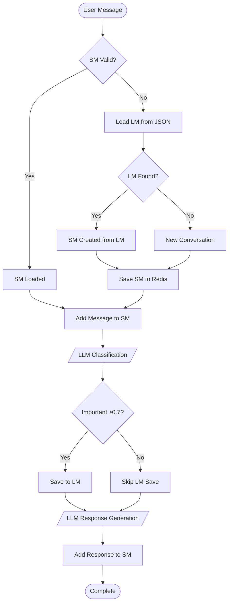

  

```mermaid
flowchart TD
      Start([User Message]) --> CheckSM{SM Valid?}

      CheckSM -->|Yes| LoadSM[SM Loaded]
      CheckSM -->|No| LoadLM[Load LM from JSON]

      LoadSM --> AddMessage[Add Message to SM]

      LoadLM --> CreateSM{LM Found?}
      CreateSM -->|Yes| NewSM[SM Created from LM]
      CreateSM -->|No| NewConv[New Conversation]

      NewSM --> SaveSM[Save SM to Redis]
      NewConv --> SaveSM

      SaveSM --> AddMessage

      AddMessage --> ClassifyEvent[/LLM Classification/]

      ClassifyEvent --> CheckImportance{Important ≥0.7?}

      CheckImportance -->|Yes| SaveLM[Save to LM]
      CheckImportance -->|No| SkipLM[Skip LM Save]

      SaveLM --> GenerateResponse[/LLM Response Generation/]
      SkipLM --> GenerateResponse

      GenerateResponse --> AddResponse[Add Response to SM]
      AddResponse --> Complete([Complete])
```
